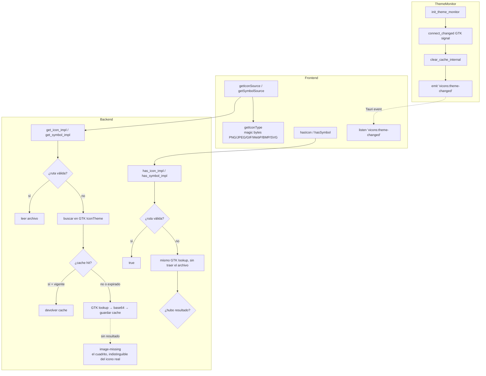

# Tauri Plugin vicons

Obtiene íconos nativos del sistema Linux (GTK) como base64, listos para usar en cualquier elemento ``. Soporta temas de iconos del sistema, cacheo automático, y detección de cambios de tema en vivo.

## Requisitos

- Rust **1.80.0+**
- Tauri **v2**
- Linux con **GTK 3** (entornos GNOME, KDE, Xfce, etc.)

## Instalación

### 1. Agregar el crate Rust

```toml
[dependencies]
tauri-plugin-vicons = { git = "https://github.com/Vasak-OS/tauri-plugin-vicons", branch = "v2" }
```

### 2. Registrar el plugin en `lib.rs`

```rust
fn main() {
    tauri::Builder::default()
        .plugin(tauri_plugin_vicons::init())
        .run(tauri::generate_context!())
        .expect("error while running tauri application");
}
```

### 3. Agregar el paquete JS (opcional)

```bash
bun add @vasakgroup/plugin-vicons
```

### 4. Configurar permisos

En `src-tauri/capabilities/default.json`:

```json
{
  "permissions": [
    "vicons:default"
  ]
}
```

## API

### Comandos Rust

| Comando      | Descripción                                    | Retorno                  |
|-------------|------------------------------------------------|--------------------------|
| `get_icon`  | Obtiene un icono regular por nombre o ruta     | `String` (base64)        |
| `get_symbol`| Obtiene un icono simbólico por nombre o ruta   | `String` (base64)        |
| `has_icon`  | Si el tema tiene el icono regular, sin traerlo | `bool`                   |
| `has_symbol`| Si el tema tiene el icono simbólico            | `bool`                   |

Los cuatro aceptan un solo argumento `name: &str`. Si es una **ruta de archivo válida**, leen el archivo directamente. Si es un **nombre de icono GTK**, lo buscan en el tema de iconos del sistema.

`has_icon` y `has_symbol` hacen **la misma búsqueda** que su `get_` —mismo tamaño, mismas banderas—, así que un `true` garantiza que el `get_` correspondiente devuelve ese icono.

### Eventos emitidos

| Evento                    | Cuándo se emite                          | Payload |
|---------------------------|------------------------------------------|---------|
| `vicons:theme-changed`    | El tema de iconos del sistema cambió     | `null`  |

Escucharlo desde el frontend:

```typescript
import { listen } from "@tauri-apps/api/event";

await listen("vicons:theme-changed", () => {
  // recargar íconos, refrescar UI, etc.
});
```

### Funciones JS (guest-js)

| Función            | Descripción                                                     | Retorno                |
|-------------------|-----------------------------------------------------------------|------------------------|
| `getIconSource`   | Obtiene un data URI completo listo para ``             | `string`               |
| `getSymbolSource` | Igual que `getIconSource` pero con iconos simbólicos            | `string`               |
| `getIcon`         | Obtiene solo el base64 de un icono regular (sin data URI)       | `Promise<string>`      |
| `getSymbol`       | Obtiene solo el base64 de un icono simbólico (sin data URI)     | `Promise<string>`      |
| `hasIcon`         | Si el tema tiene el icono, para elegir antes de dibujar          | `Promise<boolean>`     |
| `hasSymbol`       | Igual que `hasIcon` pero con iconos simbólicos                   | `Promise<boolean>`     |

`getIconSource` y `getSymbolSource` detectan automáticamente el **tipo MIME** del icono (PNG, JPEG, GIF, WebP, BMP, SVG) mediante magic bytes.

### Por qué hacen falta `hasIcon` y `hasSymbol`

`getIconSource` y `getSymbolSource` **no fallan** cuando el icono no está: el tema
devuelve `image-missing` —el cuadrito de imagen rota— como si fuera el icono pedido, y lo
que llega es un data URI perfectamente válido. Comprobar el resultado no alcanza, porque
nunca está vacío:

```typescript
import { getSymbolSource, hasSymbol } from '@vasakgroup/plugin-vicons';

// Mal: `icono` nunca es "", así que el `if` no protege de nada.
const icono = await getSymbolSource('google-symbolic');
if (icono) mostrar(icono); // dibuja el cuadrito si el tema no lo tiene

// Bien: se pregunta primero y se elige otro nombre si falta.
const nombre = (await hasSymbol('google-symbolic'))
  ? 'google-symbolic'
  : 'goa-account-symbolic';
mostrar(await getSymbolSource(nombre));
```

Ante un error del plugin contestan `false`, no una excepción: quien pregunta esto lo hace
para elegir un icono alternativo, y caer al alternativo es lo razonable. El error queda en
la consola.

## Uso

### Básico

```typescript
import { getIconSource } from '@vasakgroup/plugin-vicons';

const icon = await getIconSource('folder');
// → "data:image/svg+xml;base64,PHN2ZyB4bWxucz0..."
```

### Con Vue

```vue
<script setup lang="ts">
import { getIconSource } from '@vasakgroup/plugin-vicons';
import { ref, onMounted } from 'vue';

const icon = ref('');
onMounted(async () => {
  icon.value = await getIconSource('folder');
});
</script>

<template>
  
</template>
```

### Con React

```tsx
import { getIconSource } from '@vasakgroup/plugin-vicons';
import { useEffect, useState } from 'react';

function FolderIcon() {
  const [src, setSrc] = useState('');
  useEffect(() => {
    getIconSource('folder').then(setSrc);
  }, []);
  return ;
}
```

### Ruta de archivo directa

Si pasás una ruta de archivo existente, se lee directamente sin pasar por el tema GTK:

```typescript
const icon = await getIconSource('/usr/share/icons/hicolor/48x48/apps/firefox.png');
```

### Escuchar cambios de tema

El plugin detecta automáticamente cambios en el tema de iconos del sistema (a través de la señal `changed` de GTK) y emite un evento:

```typescript
import { listen } from "@tauri-apps/api/event";
import { getIconSource } from '@vasakgroup/plugin-vicons';

listen("vicons:theme-changed", async () => {
  console.log("Theme changed, refreshing icons...");
  const icon = await getIconSource('folder');
  // actualizar UI con el nuevo icono
});
```

## Arquitectura



### Cache

- Dos cachés separadas: `ICON_CACHE` y `SYMBOL_CACHE` (`HashMap<String, CacheEntry>`).
- Cada entrada expira después de **30 minutos**.
- Al cambiar el tema de iconos del sistema, **ambos cachés se limpian por completo**.
- La caché usa `std::sync::LazyLock` y `std::sync::Mutex` (sin dependencias externas).

### Detección de cambios de tema

GTK monitorea internamente los cambios de tema mediante:

- **GSettings** (`org.gnome.desktop.interface icon-theme`)
- **inotify** sobre `~/.config/gtk-3.0/settings.ini`
- **XDG Desktop Portal**

Cuando detecta un cambio, dispara la señal `changed` del `IconTheme`. El plugin la captura, limpia la caché, y emite `vicons:theme-changed` al frontend.

### Logging

El plugin escribe logs en `{app_data_dir}/logs/icons.log` con niveles INFO, WARN y ERROR. Sin dependencias externas de logging — usa `std::io::LineWriter` directo a archivo.

## Errores

| Error               | Causa                                       |
|---------------------|---------------------------------------------|
| `IconNotFound`      | El nombre solicitado no existe en el tema   |
| `ThemeMonitorError` | No se pudo inicializar el monitor de tema   |
| `Io`                | Error de lectura de archivo                 |

## Dependencias

Solo 5 crates además de Tauri:

| Crate       | Propósito                     |
|------------|-------------------------------|
| `serde`    | Serialización                 |
| `thiserror`| Errores tipados               |
| `gtk`      | Acceso al theme de iconos GTK |
| `glib`     | Bindings de GLib (con GTK)    |
| `base64`   | Codificación base64           |

## Licencia

GPLv3 — Vasak Group
